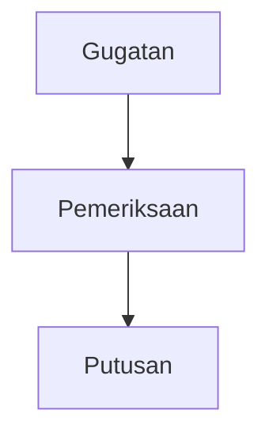

# BE Guide: Full Migration to OpenUI Lang Format

> **Audience:** Backend engineers on the ask-decision service.
> **Scenario:** This document covers what needs to change if the team decides to fully adopt OpenUI Lang as the LLM output format — replacing the current markdown-based stream with structured generative UI components.
> **Read this alongside:** `decision-stream-api.md` (existing stream format reference).

---

## What is OpenUI Lang?

OpenUI Lang is a **structured LLM output language** for defining UI components declaratively. Instead of the LLM writing markdown, it writes component definitions that the frontend renders as interactive React components (Recharts charts, interactive flow diagrams, etc.).

Example — current output (markdown):
```
Berdasarkan data putusan tahun 2023, terdapat 42 putusan pidana.
Distribusi per kuartal: Q1: 10, Q2: 17, Q3: 9, Q4: 6.


```

Same content in OpenUI Lang:
```
root = Card([header, summary, chart, diagram])
header = CardHeader("Putusan Pidana 2023", "42 putusan total")
summary = TextContent("Distribusi terbanyak terjadi pada Q2 dengan 17 putusan.")
p1 = DataPoint("Q1", [10])
p2 = DataPoint("Q2", [17])
p3 = DataPoint("Q3", [9])
p4 = DataPoint("Q4", [6])
chart = RechartsBarChart("Putusan per Kuartal", ["Jumlah"], [p1, p2, p3, p4])
n1 = FlowNode("n1", "Gugatan", "input")
n2 = FlowNode("n2", "Pemeriksaan", "default")
n3 = FlowNode("n3", "Putusan", "output")
e1 = FlowEdge("e1", "n1", "n2")
e2 = FlowEdge("e2", "n2", "n3")
diagram = FlowDiagram("Alur Perkara", [n1,n2,n3], [e1,e2])
```

The FE renders this as a **live interactive card** with a real Recharts bar chart and a draggable React Flow diagram — not static text or a PNG image.

---

## What Changes in the BE

### The good news: the SSE envelope does NOT change

The event structure from `decision-stream-api.md` remains identical:
- Preamble events: `{ is_preamble: true, answer: "..." }` — unchanged
- Answer chunks: `{ answer: "...", source: "", paraphrase_question: "" }` — unchanged
- Closing event: `{ answer: "", source: "...", paraphrase_question: "..." }` — unchanged

**Only the content of `answer` chunks changes.** Instead of markdown text, the `answer` chunks now carry OpenUI Lang tokens.

### What actually needs to change

#### 1. LLM system prompt

This is the primary change. The LLM must be instructed to output OpenUI Lang instead of markdown.

The full system prompt to inject is below (Section: System Prompt to Add). It covers:
- Syntax rules
- Available components (layout, charts, flow diagrams)
- Component signatures and positional arguments
- Streaming order (root first, then components, then data)
- Rules and examples

#### 2. LLM output parsing / passthrough

Currently the BE may strip or post-process the LLM output before streaming. With OpenUI Lang, the output must be **streamed token-by-token as-is** — the FE parser is incremental and expects raw tokens. Do not buffer and re-emit; do not strip whitespace or newlines.

#### 3. Conversation history storage (see dedicated section below)

The format of stored assistant messages changes. Needs a decision on storage strategy before migrating.

---

## Available Components (What the LLM Can Generate)

These are the components the FE has registered. The LLM may only use these — any component not in this list will be ignored by the FE renderer.

### Layout
| Component | Signature | Use for |
|---|---|---|
| `Card` | `Card([children])` | Root container — every response must start here |
| `CardHeader` | `CardHeader(title, subtitle?)` | Title at top of Card |
| `TextContent` | `TextContent(text, variant?)` | Narrative text blocks (`"small"` for footnotes) |

### Charts (Recharts — interactive)
| Component | Signature | Use for |
|---|---|---|
| `DataPoint` | `DataPoint(label, values[])` | One x-axis point for line/bar charts |
| `RechartsLineChart` | `RechartsLineChart(title, series[], points[])` | Trends over time, continuous data |
| `RechartsBarChart` | `RechartsBarChart(title, series[], points[])` | Category comparisons |
| `RechartsPieSlice` | `RechartsPieSlice(label, value)` | One slice of a pie |
| `RechartsPieChart` | `RechartsPieChart(title, slices[])` | Proportions, composition |

### Flow Diagrams (React Flow — draggable/interactive)
| Component | Signature | Use for |
|---|---|---|
| `FlowNode` | `FlowNode(id, label, type?)` | One node. `type`: `"input"` / `"default"` / `"output"` |
| `FlowEdge` | `FlowEdge(id, source, target, label?)` | Directed arrow between nodes |
| `FlowDiagram` | `FlowDiagram(title, nodes[], edges[])` | Process flows, approval chains, architecture diagrams |

---

## Critical Concern: Mermaid Diagram Coverage Gap

**This is a real migration risk.** Mermaid supports many diagram types that have no equivalent in the current OpenUI component library:

| Mermaid diagram type | OpenUI equivalent | Status |
|---|---|---|
| `graph TD` / `graph LR` (flowchart) | `FlowDiagram` with FlowNode/FlowEdge | **Supported** |
| `sequenceDiagram` | None | **Not supported** |
| `classDiagram` | None | **Not supported** |
| `gantt` | None | **Not supported** |
| `gitGraph` | None | **Not supported** |
| `erDiagram` | None | **Not supported** |
| `stateDiagram` | None | **Not supported** |

**Decision required before migrating:**
- If the ask-decision LLM currently generates sequence diagrams, class diagrams, or state diagrams: those will become unrenderable after migration.
- Option A: Expand the FE component library to add these diagram types before migrating.
- Option B: Fall back to `TextContent` for unsupported diagram types (loses visual output).
- Option C: Keep Mermaid for unsupported types and use OpenUI only for charts and flowcharts (hybrid approach — see `openui-implementation-guide.md` Phase 3).

---

## Critical Concern: Conversation History Storage

This is the most complex part of the migration. Currently, conversation history (used for follow-up questions via `session_id`) stores the assistant's prior response as **plain text**. That text is readable by humans and can be re-fed to the LLM as context cheaply.

After migration, the assistant response is **OpenUI Lang** — structured code, not prose. You need a storage strategy:

### Option A: Store raw OpenUI Lang (simplest)

Store the OpenUI Lang string as the assistant message in history.

```
[assistant]: root = Card([header, chart])\nheader = CardHeader("Putusan 2023")\n...
```

**Pros:** Lossless — can re-render from history.
**Cons:** High token cost when re-fed to LLM as context. LLM may be confused by its own prior code as "conversation context". Unreadable in admin/debug tools.

### Option B: Store plain text summary alongside (recommended)

Before streaming OpenUI Lang, have the LLM also generate a short plain-text summary for history. Store the summary as the assistant message; the OpenUI Lang is display-only and not stored in the conversational context.

Prompt strategy: add a `[HISTORY_SUMMARY]` field that the LLM emits as the first line, then the BE strips it before streaming to FE and stores it separately.

```
[HISTORY_SUMMARY]: Terdapat 42 putusan pidana pada 2023 dengan puncak Q2 (17 putusan). Alur perkara terdiri dari 3 tahap.
root = Card([header, summary, chart, ...])
...
```

**Pros:** Efficient history (prose, not code). LLM gets clean conversational context for follow-ups. Human-readable in logs.
**Cons:** Requires prompt engineering to get reliable `[HISTORY_SUMMARY]` emission.

### Option C: Store both

Store the OpenUI Lang for display re-rendering AND the extracted text summary for LLM context. Use the text summary when constructing the `messages` array for the next LLM call.

**Pros:** Best of both — re-renderable history AND efficient context.
**Cons:** More storage, more parsing.

**Recommendation:** Option B or C. Never feed raw OpenUI Lang back as LLM conversation context — it wastes tokens and degrades follow-up quality.

---

## System Prompt to Add

Inject the following as the LLM system prompt (or append to the existing system prompt, after the legal/domain instructions):

```
## Output Format

You must respond ONLY in openui-lang. Do not write markdown, prose, or plain text outside of openui-lang component arguments.

### Syntax Rules

1. Each statement on its own line: `identifier = Expression`
2. `root` is the entry point — always define `root = Card(...)` FIRST
3. Expressions are: strings ("..."), numbers, booleans, arrays ([...]), component calls TypeName(arg1, arg2, ...)
4. Arguments are POSITIONAL — order matters, not names
5. Every variable MUST be referenced from root, otherwise it will not render
6. No operators, no logic, no conditionals — only declarations
7. Strings use double quotes

### Statement Order (for progressive streaming)

Always write in this order:
1. `root = Card(...)` — renders the shell immediately
2. Component definitions (CardHeader, chart, diagram)
3. Data values (DataPoint, RechartsPieSlice, FlowNode, FlowEdge)

### Components

Card([children]) — root container
CardHeader(title: string, subtitle?: string) — title block
TextContent(text: string, variant?: string) — text ("small" for footnotes)

DataPoint(label: string, values: number[]) — x-axis point for bar/line charts
RechartsLineChart(title: string, series: string[], points: DataPoint[]) — trends over time
RechartsBarChart(title: string, series: string[], points: DataPoint[]) — category comparisons
RechartsPieSlice(label: string, value: number) — one slice of a pie chart
RechartsPieChart(title: string, slices: RechartsPieSlice[]) — proportions/composition

FlowNode(id: string, label: string, type?: "input"|"default"|"output") — one node
FlowEdge(id: string, source: string, target: string, label?: string) — arrow between nodes
FlowDiagram(title: string, nodes: FlowNode[], edges: FlowEdge[]) — process/approval/architecture flow

### Rules

- ALWAYS start with root = Card(...)
- Use RechartsBarChart for counts, comparisons, rankings
- Use RechartsLineChart for time-series / trends
- Use RechartsPieChart for proportions / percentages
- Use FlowDiagram for process flows, approval chains, architectures (NOT for numeric data)
- Use TextContent for narrative explanation alongside charts
- Define child references (DataPoint, FlowNode, etc.) BEFORE the parent component that references them
- NEVER output markdown, code blocks, or prose outside of component string arguments

### Example

root = Card([header, summary, chart])
header = CardHeader("Putusan Pidana 2023", "42 total putusan")
summary = TextContent("Terbanyak pada Q2 dengan 17 putusan.")
p1 = DataPoint("Q1", [10])
p2 = DataPoint("Q2", [17])
p3 = DataPoint("Q3", [9])
p4 = DataPoint("Q4", [6])
chart = RechartsBarChart("Distribusi Putusan per Kuartal", ["Jumlah Putusan"], [p1, p2, p3, p4])
```

---

## Benefits of Full Migration

| Capability | Current (markdown) | After migration (OpenUI) |
|---|---|---|
| Text answer | Plain markdown | `TextContent` in a styled card |
| Bar / line / pie chart | Static Mermaid or `statistical_result` post-hoc | Live Recharts component, interactive, tooltips |
| Flow diagram | Static Mermaid SVG | Draggable React Flow diagram, zoomable |
| Streaming experience | Text appears character by character | UI shell appears first, data fills in progressively |
| Chart interactivity | None (SVG) | Hover tooltips, legend toggle, zoom |
| Consistency | LLM may mix markdown styles | Enforced component structure every response |
| FE rendering | ReactMarkdown + mermaid.js | Single `<FullScreen>` component handles everything |

---

## What Does NOT Change

- SSE event envelope (`is_preamble`, `source`, `paraphrase_question`, closing event detection)
- `statistical_result` in closing event — still useful as a fallback / structured data source
- Source citation URLs
- Preamble loading steps
- Session ID / conversation management endpoint
- All query parameters and validation

---

## Migration Checklist (BE)

- [ ] **Resolve history storage strategy** (Option B or C recommended) before any other step
- [ ] **Audit Mermaid usage** — identify which Mermaid diagram types the LLM currently generates. If sequence/class/state diagrams are used, either expand FE library or plan fallback.
- [ ] Append OpenUI Lang system prompt to existing LLM system prompt
- [ ] Ensure LLM output is streamed token-by-token, not buffered
- [ ] Strip `[HISTORY_SUMMARY]` before streaming if using Option B/C, store separately
- [ ] Test with statistical pathway (PATH D) — `statistical_result` + OpenUI Lang can coexist, but chart rendering will move to the LLM output rather than the FE mapping the structured data
- [ ] Coordinate with FE on `streamProtocol` adapter (FE switches from custom adapter to `openAIReadableStreamAdapter` or equivalent)

---

## What FE Changes in Response

When the BE migrates to OpenUI Lang output, the FE can simplify significantly:

- Replace custom streaming UI with `<FullScreen streamProtocol={askDecisionStreamAdapter()} />`
- The adapter only needs to forward `answer` chunks — preamble and closing logic stays the same
- Mermaid rendering (`ReactMarkdown` + `mermaid.js`) can be removed for diagram types now covered by `FlowDiagram`
- `StatisticalChart` mapping from `statistical_result` becomes optional (charts come from LLM output directly)
