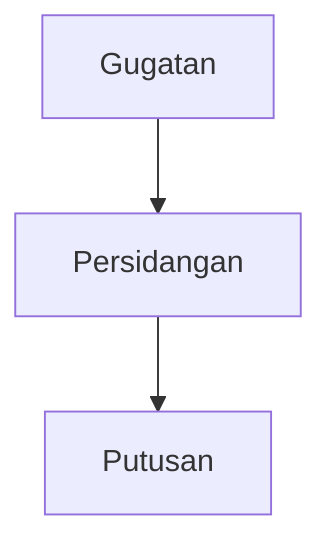

# OpenUI + Ask-Decision Integration Guide

> **Goal:** Deliver interactive charts and diagrams to users from the ask-decision API, with minimal changes to the existing backend.

---

## What `<FullScreen>` Does (Demo Context)

`<FullScreen>` from `@openuidev/react-ui` is a **complete ready-made chat UI** — it provides the input box, message history, streaming display, and renders the AI response as interactive React components (Recharts charts, flow diagrams). The current demo at `/chat` already streams via `<FullScreen>`.

The loop looks like this:

```
User types → FE sends to /api/chat → OpenAI streams OpenUI Lang back
→ FullScreen parses lang → renders live Recharts / FlowDiagram components
```

OpenUI Lang example (what the current mock backend returns):
```
root = Card([header, chart])
chart = RechartsLineChart("Revenue", ["Revenue"], [p1, p2, p3])
```

`<FullScreen>` parses that and renders actual React components. **This only works because the backend returns OpenUI Lang.** The ask-decision backend returns markdown — so `<FullScreen>` is not the right fit unless we adapt the output.

---

## Current State & The Problem

The ask-decision API streams **markdown text** with embedded Mermaid code blocks inside `answer` chunks:

```json
{ "answer": "```mermaid\ngraph TD\n    A[Gugatan] --> B[Putusan]\n```" }
```

The FE assembles the answer and renders it via ReactMarkdown + mermaid.js.

**What works:** Flowchart diagrams (`graph TD` — process flows, approval chains, architecture). Mermaid is adequate for these and should stay.

**What doesn't work:** Statistical/numeric data. When the LLM tries to express bar charts, trends, or distributions as Mermaid, the result is static, hard-to-read SVGs. Mermaid was not designed for numeric charts. This is the problem we're solving.

---

## Approach: Two Phases

### Phase 1 — Interactive charts via `statistical_result` (next step — minimal BE change)

The closing event already supports a `statistical_result` object — it just requires `include_final=true` in the request. This gives us real Recharts components driven by structured data from the BE.

The split:
- `graph TD` (flowchart) → stays as Mermaid, already works
- Bar / line / pie / ranking (numeric) → `statistical_result` → Recharts

**BE change:** Pass `include_final=true` when calling the upstream API (already supported).

**FE change:** Detect `statistical_result` in the closing event and map to a chart component.

```ts
if (event.answer === "" && "source" in event) {
  if (event.statistical_result) {
    setChartData(event.statistical_result);
  }
  setSourceUrls(event.source);
  break;
}
```

```tsx
import {
  BarChart, Bar, LineChart, Line, PieChart, Pie, Cell,
  XAxis, YAxis, Tooltip, ResponsiveContainer
} from "recharts";

export function StatisticalChart({ result }: { result: StatisticalResult }) {
  switch (result.aggregation_type) {
    case "COUNT":
    case "RANKING":
      return (
        <ResponsiveContainer width="100%" height={300}>
          <BarChart data={result.grouped_results ?? result.court_ranking}>
            <XAxis dataKey="key" />
            <YAxis />
            <Tooltip />
            <Bar dataKey="count" fill="#6366f1" />
          </BarChart>
        </ResponsiveContainer>
      );

    case "TREND":
      return (
        <ResponsiveContainer width="100%" height={300}>
          <LineChart data={result.trend_data}>
            <XAxis dataKey="period" />
            <YAxis />
            <Tooltip />
            <Line type="monotone" dataKey="value" stroke="#6366f1" />
          </LineChart>
        </ResponsiveContainer>
      );

    case "PERCENTAGE":
      const COLORS = ["#6366f1", "#8b5cf6", "#a78bfa", "#c4b5fd", "#ddd6fe"];
      return (
        <ResponsiveContainer width="100%" height={300}>
          <PieChart>
            <Pie data={result.percentage_results} dataKey="percentage" nameKey="category">
              {result.percentage_results.map((_, i) => (
                <Cell key={i} fill={COLORS[i % COLORS.length]} />
              ))}
            </Pie>
            <Tooltip />
          </PieChart>
        </ResponsiveContainer>
      );

    default:
      return null;
  }
}
```

**Delivers:** Interactive Recharts bar, line, pie, ranking charts — driven by real aggregated data from the backend.

#### ⚠️ Phase 1 limitation: charts are not preserved in conversation history

`statistical_result` only arrives once in the closing event. It is not part of the streamed `answer` text. If the BE stores only the `answer` text as conversation history (which is typical), the chart data is lost when the user revisits the chat. They will see the text answer but no chart.

**Two options to fix this:**

**Option A — BE persists `statistical_result` alongside the conversation turn (simpler)**

The BE stores the `statistical_result` JSON in the conversation history record, keyed to that turn. The history retrieval API returns it together with the text. FE renders the chart on revisit from the stored data.

```
History record:
{
  "role": "assistant",
  "content": "Terdapat 42 putusan pidana pada 2023...",
  "statistical_result": { "aggregation_type": "TREND", ... }  ← stored alongside
}
```

Requires the history API to return `statistical_result` per turn. No LLM prompt change needed.

**Option B — Phase 2 (inline chart in the answer string)**

The LLM embeds the chart definition inside the `answer` text as a standard markdown code fence — ` ```openui `, consistent with how Mermaid uses ` ```mermaid `:

````
Berdasarkan data, terdapat 42 putusan pidana pada 2023.

```openui
root = Card([header, chart])
header = CardHeader("Putusan Pidana 2023", "42 total")
p1 = DataPoint("Q1", [10])
p2 = DataPoint("Q2", [17])
chart = RechartsBarChart("Per Kuartal", ["Jumlah"], [p1, p2])
```

Distribusi terbanyak terjadi pada Q2.
````

The entire response is a single string — stored and re-rendered exactly as-is. No separate history field needed.

This is what Phase 2 provides. **If conversation history is a hard requirement, Phase 2 is the cleaner long-term solution.**

---

### Phase 2 — Full hybrid OpenUI (bigger change, most powerful)

For mixed narrative text + interactive charts. The LLM emits ` ```openui ` code fences alongside ` ```mermaid ` fences. The FE handles both in a single `ReactMarkdown` renderer — one extra `if` branch added to the existing Mermaid handler.

**BE change:** Add ` ```openui ` fence instructions to the LLM system prompt for statistical/chart answers.

**FE change:** Add one `if` branch to the existing Mermaid `code` renderer.

```tsx
export function HybridAnswer({ answer }: { answer: string }) {
  return (
    <ReactMarkdown
      components={{
        code({ className, children }) {
          if (className === "language-mermaid") {
            return <MermaidBlock chart={String(children)} />;
          }
          if (className === "language-openui") {
            return (
              <OpenUIRenderer
                source={String(children)}
                componentLibrary={chartLibrary}
              />
            );
          }
          return <code className={className}>{children}</code>;
        },
      }}
    >
      {answer}
    </ReactMarkdown>
  );
}
```

**Delivers:** Fully generative mixed-content responses — narrative text + interactive OpenUI charts inline. Charts are embedded in the answer string, so history works naturally.

---

## The Ask-Decision Page (not `<FullScreen>`)

For ask-decision, build a **custom streaming chat page** — not `<FullScreen>`, because the backend returns markdown, not OpenUI Lang.

```tsx
"use client";

import { useState, useRef } from "react";
import { HybridAnswer } from "@/components/HybridAnswer";
import { StatisticalChart } from "@/components/StatisticalChart";

export default function AskDecisionPage() {
  const [input, setInput] = useState("");
  const [answer, setAnswer] = useState("");
  const [loadingStep, setLoadingStep] = useState<string | null>(null);
  const [chartData, setChartData] = useState<StatisticalResult | null>(null);
  const [sources, setSources] = useState<string[]>([]);
  const sessionId = useRef(`session-${Date.now()}`);

  async function ask() {
    setAnswer("");
    setChartData(null);
    setSources([]);

    const url = new URL("/api/decisions/ask", window.location.origin);
    url.searchParams.set("question", input);
    url.searchParams.set("session_id", sessionId.current);
    url.searchParams.set("include_final", "true");

    const res = await fetch(url.toString());
    const reader = res.body!.getReader();
    const decoder = new TextDecoder();
    let buffer = "";

    while (true) {
      const { done, value } = await reader.read();
      if (done) break;

      buffer += decoder.decode(value, { stream: true });
      const lines = buffer.split("\n");
      buffer = lines.pop() ?? "";

      for (const line of lines) {
        if (!line.startsWith("data: ")) continue;
        try {
          const event = JSON.parse(line.slice(6));

          if (event.is_preamble) {
            setLoadingStep(event.answer);
            continue;
          }

          if (event.answer === "" && "source" in event) {
            setLoadingStep(null);
            if (event.source) setSources(event.source.split(","));
            if (event.statistical_result) setChartData(event.statistical_result);
            break;
          }

          if (event.answer) {
            setAnswer((prev) => prev + event.answer);
          }
        } catch {}
      }
    }
  }

  return (
    <div className="max-w-3xl mx-auto p-6">
      <div className="flex gap-2 mb-6">
        <input
          value={input}
          onChange={(e) => setInput(e.target.value)}
          onKeyDown={(e) => e.key === "Enter" && ask()}
          placeholder="Tanyakan tentang putusan..."
          className="flex-1 border rounded px-3 py-2"
        />
        <button onClick={ask} className="bg-indigo-600 text-white px-4 py-2 rounded">
          Kirim
        </button>
      </div>

      {loadingStep && (
        <div className="text-sm text-gray-500 mb-4 italic">{loadingStep}...</div>
      )}

      {/* Phase 2: HybridAnswer handles both ```mermaid and ```openui blocks */}
      {answer && <HybridAnswer answer={answer} />}

      {/* Phase 1 only: chart from statistical_result in closing event */}
      {chartData && <StatisticalChart result={chartData} />}

      {sources.length > 0 && (
        <div className="mt-4 text-sm text-gray-500">
          <strong>Sumber:</strong>
          <ul className="list-disc pl-4 mt-1">
            {sources.map((s, i) => <li key={i}><a href={s} className="text-indigo-600">{s}</a></li>)}
          </ul>
        </div>
      )}
    </div>
  );
}
```

---

## Summary: What Changes Where

| Phase | BE change | FE change | Delivers | History on revisit |
|---|---|---|---|---|
| **Current** — Mermaid only | — | — | Flowcharts (`graph TD`) ✅, numeric charts ❌ | ✅ Text + diagram in answer string |
| **Phase 1** — Statistical charts | Pass `include_final=true` | Detect `statistical_result` → Recharts | Interactive bar/line/pie charts | ⚠️ Chart lost unless BE also stores `statistical_result` in history (Option A) |
| **Phase 2** — Full hybrid OpenUI | Add ` ```openui ` to LLM prompt | Add `language-openui` branch to Mermaid renderer | Generative mixed content | ✅ Chart embedded in answer string — re-renderable |

**If conversation history is a requirement, choose:**
- Phase 1 + Option A (store `statistical_result` in history record) — simpler BE work
- Phase 2 — cleaner long-term, chart lives in the answer string itself

---

## Testing in This Demo Repository

The goal is to test the full rendering pipeline — preamble loading, markdown text, Mermaid flowchart, and ` ```openui ` chart block — without needing the real ask-decision backend.

### What to add to the demo

**1. Mock SSE endpoint — `app/api/decisions/ask-mock/route.ts`**

Emits fake ask-decision SSE events in the correct format: preamble steps → answer chunks (with mixed markdown + mermaid + openui) → closing event with sources.

Note the format difference from the existing `/api/chat-mock`:
- `chat-mock` uses **NDJSON** (one JSON object per line, no prefix) — for OpenAI format
- This mock uses **SSE** (`data: {...}\n\n`) — for ask-decision format

```ts
// app/api/decisions/ask-mock/route.ts
import { NextRequest } from "next/server";

// Mix of: plain markdown, ```mermaid flowchart, ```openui bar chart
const MOCK_ANSWER = `Berdasarkan analisis putusan tahun 2023, terdapat **42 putusan pidana** yang masuk ke sistem.

Berikut alur umum penanganan perkara pidana:

\`\`\`mermaid
graph TD
  A[Laporan Masuk] --> B[Penyidikan]
  B --> C[Penuntutan]
  C --> D[Persidangan]
  D --> E[Putusan]
\`\`\`

Distribusi putusan per kuartal menunjukkan peningkatan signifikan pada Q2:

\`\`\`openui
root = Card([header, chart])
header = CardHeader("Putusan Pidana per Kuartal 2023", "Total: 42 putusan")
p1 = DataPoint("Q1", [10])
p2 = DataPoint("Q2", [17])
p3 = DataPoint("Q3", [9])
p4 = DataPoint("Q4", [6])
chart = RechartsBarChart("Jumlah Putusan", ["Putusan"], [p1, p2, p3, p4])
\`\`\`

Peningkatan pada Q2 berkaitan dengan penyelesaian tunggakan perkara semester sebelumnya.`;

const PREAMBLE_STEPS = [
  "Memahami konteks pertanyaan",
  "Memvalidasi konteks hukum",
  "Mengklasifikasikan pertanyaan",
  "Mencari putusan",
  "Memproses dokumen",
  "Menyusun jawaban",
];

const MOCK_SOURCES =
  "https://www.hukumonline.com/pusatdata/detail/mock-guid-1," +
  "https://www.hukumonline.com/pusatdata/detail/mock-guid-2";

function sseEvent(data: object): string {
  return `data: ${JSON.stringify(data)}\n\n`;
}

async function* mockDecisionStream(): AsyncGenerator<string> {
  // 1. Preamble steps
  for (const step of PREAMBLE_STEPS) {
    yield sseEvent({ is_preamble: true, answer: step });
    await new Promise((r) => setTimeout(r, 600));
  }

  // 2. Answer chunks (~8 chars each, matching real BE behaviour)
  const chunkSize = 8;
  for (let i = 0; i < MOCK_ANSWER.length; i += chunkSize) {
    yield sseEvent({
      answer: MOCK_ANSWER.slice(i, i + chunkSize),
      source: "",
      paraphrase_question: "",
    });
    await new Promise((r) => setTimeout(r, 30));
  }

  // 3. Closing event
  yield sseEvent({
    answer: "",
    source: MOCK_SOURCES,
    paraphrase_question: "Berapa putusan pidana pada tahun 2023 dan bagaimana distribusinya?",
  });
}

export async function GET(req: NextRequest) {
  const encoder = new TextEncoder();

  const stream = new ReadableStream({
    async start(controller) {
      for await (const chunk of mockDecisionStream()) {
        controller.enqueue(encoder.encode(chunk));
      }
      controller.close();
    },
  });

  return new Response(stream, {
    headers: {
      "Content-Type": "text/event-stream",
      "Cache-Control": "no-cache",
      Connection: "keep-alive",
    },
  });
}
```

**2. Test page — `app/ask-decision/page.tsx`**

Points to the mock endpoint instead of the real backend. Uses the `HybridAnswer` component (handles both ` ```mermaid ` and ` ```openui `).

```tsx
// app/ask-decision/page.tsx — points to mock for local testing
const url = new URL("/api/decisions/ask-mock", window.location.origin);
// swap to /api/decisions/ask for real backend
```

---

### What to verify

Run the demo and open `/ask-decision`. Check each item:

| # | What to verify | Expected |
|---|---|---|
| 1 | Preamble steps appear during loading | "Memahami konteks...", "Mencari putusan..." shown one by one, disappear when answer starts |
| 2 | Streaming text renders progressively | Answer text appears chunk by chunk as it streams |
| 3 | Markdown formatting renders | `**bold**`, bullet lists, headings render correctly (not raw asterisks) |
| 4 | ` ```mermaid ` block renders as diagram | Flowchart SVG appears inline in the answer, not as a raw code block |
| 5 | ` ```openui ` block renders as interactive chart | Recharts bar chart appears inline, with hover tooltips |
| 6 | Source URLs render after stream ends | Two hukumonline links appear below the answer |
| 7 | Mermaid and OpenUI blocks coexist | Both render in the correct position within the answer text |

**If ` ```openui ` renders as a raw code block** (not a chart): `OpenUIRenderer` is not wired up — check the `language-openui` branch in `HybridAnswer`.

**If ` ```mermaid ` renders as a raw code block**: mermaid.js is not initialised — check that `mermaid.initialize()` is called before render.

**If preamble steps never clear**: closing event detection is wrong — verify `event.answer === "" && "source" in event`.

---

## Implementation Checklist

### Phase 1 (next step)
- [ ] Pass `include_final=true` in all ask-decision requests (BE / proxy layer)
- [ ] Add `StatisticalChart` component mapping `statistical_result` → Recharts
- [ ] Detect `statistical_result` in closing event and render chart below the text answer
- [ ] Show preamble events as loading progress indicator (if not already done)
- [ ] Parse and display source URLs from closing event
- [ ] Decide: store `statistical_result` in history record (Option A) or go straight to Phase 2

### Phase 2 (later)
- [ ] Add ` ```openui ` fence instructions to LLM system prompt on BE (see prompt below)
- [ ] Add `language-openui` branch to existing Mermaid `code` renderer → `<OpenUIRenderer>`

---

## Phase 2: LLM System Prompt Addendum

This is an **addendum** — append it to the existing ask-decision system prompt. It does not replace the legal/domain instructions already there.

The key rule: the LLM already knows to emit ` ```mermaid ` for flowcharts. This prompt tells it to use ` ```openui ` for numeric/statistical charts instead.

```
## Chart and Diagram Output Format

When your answer includes a visualization, embed it as a markdown code fence using the appropriate language identifier. The frontend will render these blocks as interactive components.

### When to use ```mermaid
Use for structural/relational diagrams only:
- Process flows and approval chains (graph TD)
- System architecture
- Decision trees

Example:


### When to use ```openui
Use for ALL numeric/statistical data — never use Mermaid for this:
- Counts, totals, rankings (bar chart)
- Trends over time (line chart)
- Proportions and percentages (pie chart)

Syntax rules:
1. Each statement on its own line: identifier = ComponentName(arg1, arg2, ...)
2. Always start with: root = Card([...])
3. Arguments are POSITIONAL — order matters
4. Every variable must be referenced from root or it will not render
5. Define child references (DataPoint, etc.) BEFORE the parent component

Available components:

Card([children])
CardHeader(title: string, subtitle?: string)
TextContent(text: string, variant?: string)

DataPoint(label: string, values: number[])
RechartsLineChart(title: string, series: string[], points: DataPoint[])
RechartsBarChart(title: string, series: string[], points: DataPoint[])
RechartsPieSlice(label: string, value: number)
RechartsPieChart(title: string, slices: RechartsPieSlice[])

FlowNode(id: string, label: string, type?: "input"|"default"|"output")
FlowEdge(id: string, source: string, target: string, label?: string)
FlowDiagram(title: string, nodes: FlowNode[], edges: FlowEdge[])

Examples:

Bar chart (counts/rankings):
```openui
root = Card([header, chart])
header = CardHeader("Putusan Pidana per Kuartal 2023", "Total: 42 putusan")
p1 = DataPoint("Q1", [10])
p2 = DataPoint("Q2", [17])
p3 = DataPoint("Q3", [9])
p4 = DataPoint("Q4", [6])
chart = RechartsBarChart("Jumlah Putusan", ["Putusan"], [p1, p2, p3, p4])
```

Line chart (trends over time):
```openui
root = Card([header, chart])
header = CardHeader("Tren Putusan 2020–2023")
p1 = DataPoint("2020", [28])
p2 = DataPoint("2021", [34])
p3 = DataPoint("2022", [39])
p4 = DataPoint("2023", [42])
chart = RechartsLineChart("Jumlah Putusan per Tahun", ["Putusan"], [p1, p2, p3, p4])
```

Pie chart (proportions):
```openui
root = Card([header, chart])
header = CardHeader("Komposisi Jenis Perkara 2023")
s1 = RechartsPieSlice("Pidana", 58)
s2 = RechartsPieSlice("Perdata", 32)
s3 = RechartsPieSlice("Lainnya", 10)
chart = RechartsPieChart("Distribusi Jenis Perkara", [s1, s2, s3])
```

### Rules
- Narrative text before and after the code fence renders as normal markdown
- Never output raw numbers as a Mermaid chart — always use ```openui for numeric data
- Always include a CardHeader with a descriptive title and subtitle showing the total/context
- For multi-series data, the series array in RechartsLineChart/RechartsBarChart must match the order of values[] in each DataPoint
```
